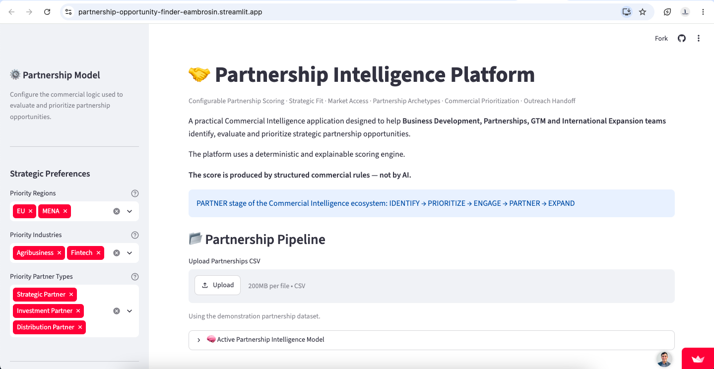
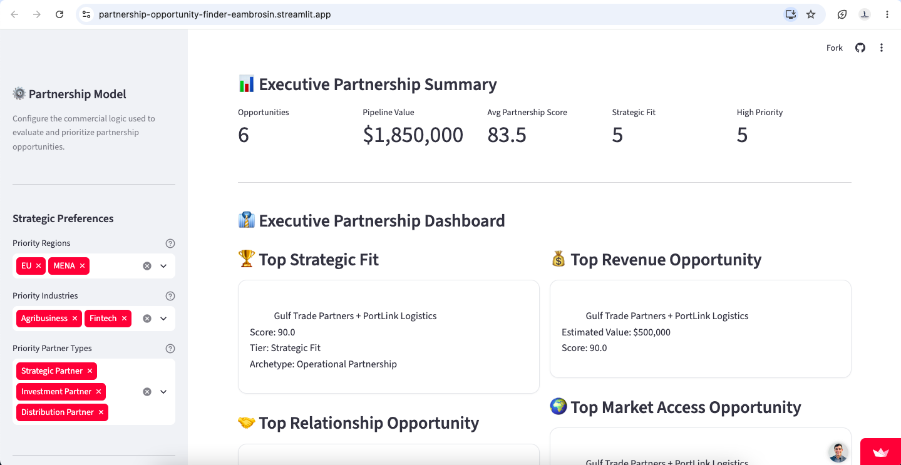
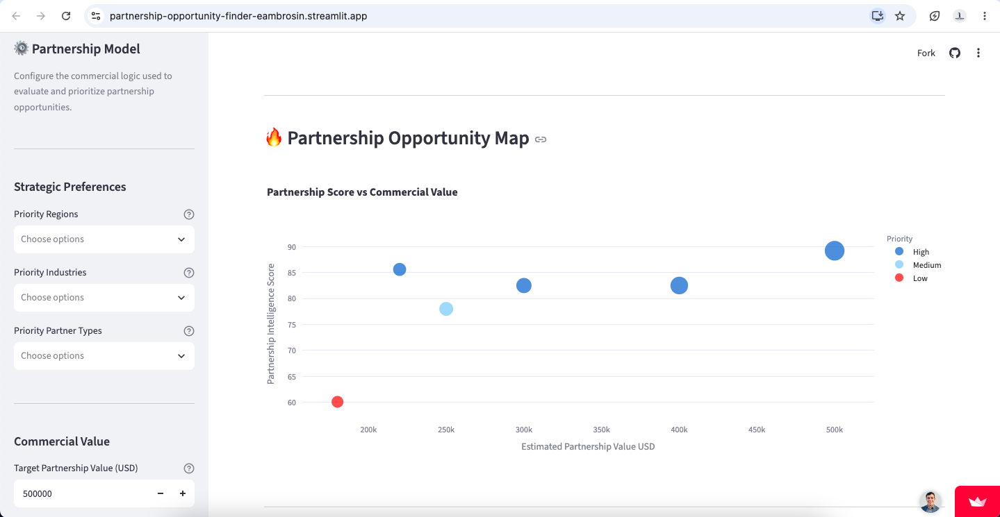
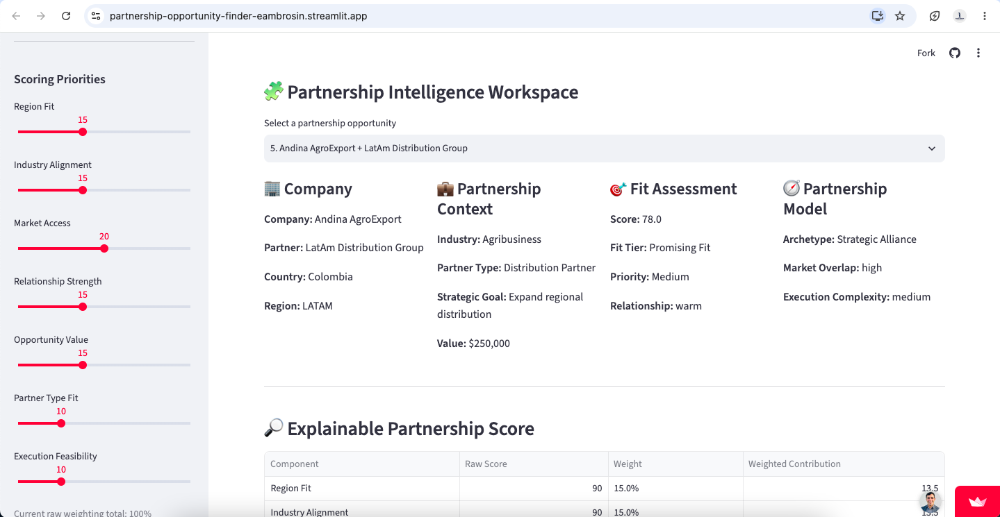
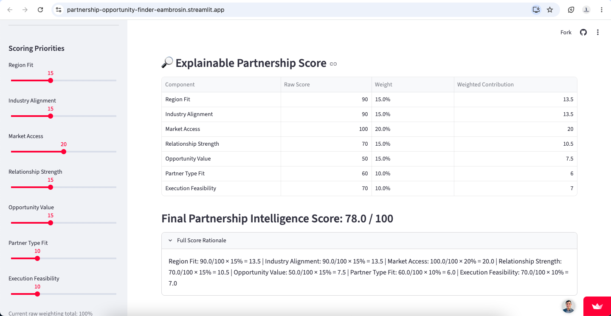
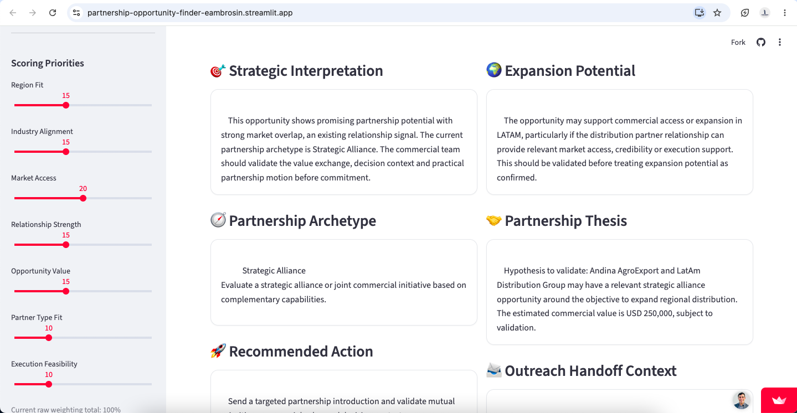

# Partnership Intelligence Platform

> A configurable and explainable decision-support platform for identifying, scoring and prioritizing strategic partnership opportunities.

[]()
[]()
[]()
[]()

🔗 **Live Demo:**  
https://partnership-opportunity-finder-eambrosin.streamlit.app/

---

## Overview

The **Partnership Intelligence Platform** is a decision-support application designed for Business Development, Strategic Partnerships, GTM and International Expansion teams.

The platform transforms partnership evaluation into a structured, configurable and explainable process.

Potential partnerships are assessed across multiple commercial dimensions and converted into an actionable **Partnership Intelligence Score**.

The platform combines:

- configurable weighted scoring
- deterministic and explainable decision logic
- strategic preference configuration
- partnership archetype classification
- fit-tier classification
- commercial prioritization
- execution feasibility assessment
- partnership model recommendations
- recommended next actions
- portfolio-level analytics
- regional partnership intelligence
- opportunity-level strategic interpretation
- expansion-potential analysis
- outreach handoff
- downloadable partnership opportunity briefs

The objective is to create a practical intelligence layer between **partner discovery, commercial prioritization and partnership execution**.

---

## Product Walkthrough

### Executive Partnership Summary

A portfolio-level view of the partnership pipeline, including opportunity volume, estimated commercial value, average Partnership Intelligence Score, Strategic Fit opportunities and High Priority opportunities.



---

### Executive Partnership Dashboard

The executive dashboard surfaces the strongest opportunities across strategic fit, relationship strength, commercial value and market access.



---

### Partnership Opportunity Map

The opportunity map compares **Partnership Intelligence Score against estimated commercial value**, helping distinguish strategic opportunities from commercially attractive but lower-fit opportunities.



---

### Explainable Partnership Scoring

Every Partnership Intelligence Score can be decomposed into its underlying commercial dimensions.

The workspace exposes raw component scores, active weights and weighted contributions, making the ranking transparent and auditable.



The detailed opportunity analysis then connects the numerical score with strategic interpretation, partnership archetype and commercial recommendations.



---

### Partnership Intelligence Workspace

Each opportunity can be investigated individually through a structured commercial workspace combining company context, partnership fit, strategic interpretation, expansion potential, partnership thesis and recommended next action.



---

## What Problem Does It Solve?

Partnership opportunities are often evaluated using fragmented information such as:

- geography
- industry
- market access
- relationship strength
- estimated commercial value
- partner type
- execution complexity

Without a structured model, these factors can be evaluated inconsistently.

The Partnership Intelligence Platform creates a repeatable framework for answering questions such as:

1. **Which partnership opportunities deserve attention?**
2. **Why does one opportunity rank above another?**
3. **What commercial signals are driving the score?**
4. **What type of partnership may be appropriate?**
5. **What should the next commercial action be?**

---

## Partnership Intelligence Model

Each opportunity is evaluated across seven scoring dimensions.

| Dimension | Default Weight |
|---|---:|
| Region Fit | 15% |
| Industry Alignment | 15% |
| Market Access | 20% |
| Relationship Strength | 15% |
| Opportunity Value | 15% |
| Partner Type Fit | 10% |
| Execution Feasibility | 10% |

**Total: 100%**

These are the default weights used by the scoring engine.

Users can modify the weighting model through the Streamlit interface.

The engine automatically normalizes active weights to 100%, allowing the scoring strategy to be adjusted without requiring users to manually rebalance every dimension.

---

## Scoring Dimensions

### Region Fit

Evaluates the strategic relevance of the opportunity's geographic region.

The default model includes configurable scoring for regions such as:

- LATAM
- MENA
- EU
- North America
- APAC
- Africa

Users can also select priority regions through the interface.

Selected priority regions receive the strongest Region Fit score.

---

### Industry Alignment

Measures how closely the partner's industry aligns with the active commercial strategy.

The default configuration includes industries such as:

- Renewable Energy
- Agribusiness
- Logistics & Trade
- Fintech
- Real Estate
- Government / Public Sector

Users can define priority industries directly in the application.

---

### Market Access

Evaluates the degree of commercial or market overlap between the organizations.

The current model supports:

- High
- Medium
- Low

Higher market overlap produces a stronger Market Access score.

---

### Relationship Strength

Captures the current commercial relationship signal.

The model uses:

- Hot
- Warm
- Cold

Relationship strength influences both the final score and the recommended commercial action.

---

### Opportunity Value

Scores the estimated commercial value of the partnership relative to a configurable target.

The default target partnership value is:

**USD 500,000**

Opportunity Value increases proportionally toward that target and is capped at a maximum score of 100.

This avoids reducing commercial value to a simple binary threshold.

---

### Partner Type Fit

Evaluates the strategic relevance of the type of partner.

Examples supported by the model include:

- Channel Partner
- Distributor
- Reseller
- Strategic Alliance
- Technology Partner
- Institutional Partner
- Government Partner
- Market Entry Partner
- Commercial Representative
- Operational Partner
- Logistics Partner
- Execution Partner
- Service Delivery Partner
- Referral Partner
- Consulting Partner

Users can also define priority partner types through the interface.

---

### Execution Feasibility

Measures how practical the opportunity may be to execute.

The model evaluates execution complexity as:

- Low
- Medium
- High

Lower execution complexity produces a stronger Execution Feasibility score.

---

## Configurable Partnership Strategy

The application allows the user to dynamically adjust the partnership model.

Users can configure:

- priority regions
- priority industries
- priority partner types
- target partnership value
- scoring weights
- fit thresholds

This allows the same engine to support different commercial strategies.

For example:

- an international expansion strategy may place greater emphasis on **Region Fit** and **Market Access**
- a channel strategy may emphasize **Partner Type Fit**
- a high-value enterprise strategy may increase the importance of **Opportunity Value**
- an early-stage commercial program may prioritize **Execution Feasibility** and **Relationship Strength**

---

## Deterministic and Explainable Scoring

The core scoring model is deterministic.

The final Partnership Intelligence Score is calculated from the weighted contribution of each scoring dimension.

Conceptually:

```text
Partnership Intelligence Score

= Region Fit × Weight
+ Industry Alignment × Weight
+ Market Access × Weight
+ Relationship Strength × Weight
+ Opportunity Value × Weight
+ Partner Type Fit × Weight
+ Execution Feasibility × Weight
```

The output is a score from **0 to 100**.

The platform exposes:

- raw score by component
- normalized weight
- weighted contribution
- final Partnership Intelligence Score

This makes the model:

- reproducible
- explainable
- auditable
- configurable

The goal is not to replace commercial judgment.

The platform is designed to **structure and augment human decision-making**.

---

## Fit Tiers

The final score is converted into a partnership fit classification.

The default thresholds are:

| Score | Fit Tier |
|---|---|
| 80+ | Strategic Fit |
| 65–79.9 | Promising Fit |
| 50–64.9 | Exploratory Fit |
| Below 50 | Low Fit |

These thresholds are configurable through the application.

---

## Commercial Priority

The platform also converts the Partnership Intelligence Score into a commercial priority level.

| Score | Priority |
|---|---|
| Strategic Fit threshold or above | High |
| Promising Fit threshold or above | Medium |
| Below Promising Fit | Low |

This priority classification is also used in the downstream outreach handoff.

---

## Partnership Archetypes

The engine classifies opportunities according to the likely partnership motion.

Current archetypes include:

- Operational Partnership
- Channel Partnership
- Technology Alliance
- Institutional Partnership
- Referral Partnership
- Market Access Partnership
- Strategic Alliance

The classification uses the combination of:

- partner type
- strategic goal

This creates a more commercially useful interpretation than relying on a generic partnership label.

---

## Recommended Partnership Models

Once the archetype is identified, the platform generates an appropriate partnership model to evaluate.

Examples include:

### Operational Partnership

Potential models:

- operational collaboration
- service-delivery agreement
- execution partnership

### Channel Partnership

Potential models:

- reseller
- distribution
- co-selling

### Technology Alliance

Potential models:

- integration
- co-solution
- joint go-to-market

### Institutional Partnership

Potential models:

- institutional collaboration
- program partnership
- structured B2G engagement

### Referral Partnership

Potential models:

- referral
- introduction
- lead-sharing

### Market Access Partnership

Potential models:

- local representation
- market-entry support
- distribution
- commercial access

### Strategic Alliance

Potential models:

- strategic alliance
- joint commercial initiative
- complementary-capability collaboration

---

## Recommended Next Action

The system does not stop at scoring.

It combines the opportunity's score and relationship signal to recommend a commercial next step.

Possible recommendations include:

- schedule an executive discovery call
- prepare a joint value hypothesis
- conduct targeted partner research
- identify the strongest introduction path
- validate mutual commercial priorities
- build relationship momentum
- validate strategic fit before allocating significant resources
- keep the opportunity in nurture

This creates a bridge between **analysis and execution**.

---

## Strategic Interpretation

Each opportunity receives a structured commercial interpretation.

The engine considers signals such as:

- market overlap
- relationship strength
- execution conditions
- overall fit score
- partnership archetype

The output is designed to help a Business Development professional quickly understand the strategic context behind the numerical score.

---

## Expansion Potential

The platform also generates a separate expansion-potential assessment.

This is **not part of the mathematical Partnership Intelligence Score**.

Instead, it provides a structured interpretation of whether the partnership may support:

- regional expansion
- commercial access
- market credibility
- local execution
- market-entry support

Expansion potential is explicitly presented as a hypothesis that must be validated through commercial discovery.

---

## Partnership Thesis

For every evaluated opportunity, the system generates a structured partnership hypothesis.

The thesis combines:

- company
- partner
- partnership archetype
- strategic objective
- estimated commercial value

The purpose is to provide a concise commercial hypothesis that can be validated during partnership discovery.

---

## Executive Partnership Dashboard

The Streamlit interface provides an executive-level overview of the partnership pipeline.

Key elements include:

- number of partnership opportunities
- total estimated pipeline value
- average Partnership Intelligence Score
- number of Strategic Fit opportunities
- number of High Priority opportunities

The dashboard also surfaces:

- Top Strategic Fit
- Top Revenue Opportunity
- Top Relationship Opportunity
- Top Market Access Opportunity

---

## Partnership Opportunity Map

The application includes a portfolio visualization comparing:

**Partnership Intelligence Score vs Estimated Commercial Value**

Bubble size represents estimated opportunity value.

Priority classification is used to segment opportunities visually.

This allows users to identify combinations such as:

- high-value / high-fit opportunities
- high-value / low-fit opportunities
- lower-value strategic opportunities
- opportunities requiring further validation

---

## Regional Partnership Intelligence

The platform aggregates opportunities by region.

Regional analysis includes:

- total pipeline value
- average partnership score
- number of opportunities

This helps identify where the strongest partnership pipeline is concentrated geographically.

---

## Partnership Archetype Analysis

The application also aggregates partnership opportunities by archetype.

Users can analyze:

- number of opportunities by archetype
- pipeline value by archetype
- average score by archetype

This provides a portfolio-level view of the organization's partnership strategy.

---

## Executive Recommendation Center

The highest-ranked opportunities are surfaced in an executive recommendation section.

Each recommendation includes:

- Partnership Intelligence Score
- Fit Tier
- Priority
- Partnership Archetype
- Estimated Value
- Strategic Interpretation
- Recommended Partnership Model
- Next Best Action

This converts the ranked pipeline into an actionable commercial view.

---

## Partnership Intelligence Workspace

The application includes an opportunity-level workspace for deeper evaluation.

Users can select an individual partnership and inspect:

### Company Context

- company
- partner
- country
- region

### Partnership Context

- industry
- partner type
- strategic goal
- estimated value

### Fit Assessment

- Partnership Intelligence Score
- Fit Tier
- Priority
- relationship signal

### Partnership Model

- archetype
- market overlap
- execution complexity

---

## Explainable Score Breakdown

For each selected opportunity, the platform exposes the complete score composition.

Example structure:

| Component | Raw Score | Weight | Weighted Contribution |
|---|---:|---:|---:|
| Region Fit | 90 | 15% | 13.5 |
| Industry Alignment | 95 | 15% | 14.25 |
| Market Access | 100 | 20% | 20 |
| Relationship Strength | 70 | 15% | 10.5 |
| Opportunity Value | 80 | 15% | 12 |
| Partner Type Fit | 100 | 10% | 10 |
| Execution Feasibility | 70 | 10% | 7 |

The exact values depend on the active configuration and opportunity data.

---

## Outreach Handoff

Qualified partnership opportunities can be exported into a format designed for downstream commercial engagement.

The workflow is:

```text
PARTNERSHIP INTELLIGENCE
        ↓
Partnership Score
        ↓
Priority
        ↓
Recommended Action
        ↓
OUTREACH HANDOFF
        ↓
Adaptive Cadence
        ↓
Channel Strategy
        ↓
Commercial Message
```

The export includes fields such as:

- company name
- contact name
- country
- region
- industry
- estimated deal value
- engagement signal
- score
- outreach tier
- recommended action
- score rationale
- partner type
- partnership archetype
- strategic goal

This allows the platform to connect naturally with a broader commercial-engagement workflow.

---

## Partnership Opportunity Brief

Each individual opportunity can be exported as a structured Markdown brief.

The brief includes:

- opportunity profile
- commercial value
- Partnership Intelligence Score
- Fit Tier
- Priority
- Partnership Archetype
- relationship signal
- market overlap
- execution complexity
- strategic interpretation
- partnership thesis
- expansion potential
- recommended partnership model
- recommended next action
- score rationale
- outreach handoff context

This creates a portable summary that can support internal review, meetings and commercial preparation.

---

## Input Compatibility

The engine supports several alternative column names for easier integration with commercial datasets.

Examples include:

```text
company
company_name

partner
partner_name

deal_value_usd
estimated_deal_value_usd
partnership_value_usd

relationship_signal
engagement_signal
```

The application validates the dataset before evaluation and provides an error if required commercial fields are missing.

---

## Ranking Logic

After all opportunities are evaluated, the pipeline is ranked using:

1. Partnership Intelligence Score
2. Estimated Deal Value

Both are sorted in descending order.

This means score remains the primary decision criterion, while commercial value acts as the secondary ranking factor when opportunities have similar scores.

---

## Deterministic Intelligence + AI

The core ranking system intentionally does **not** depend on an LLM.

Partnership scoring remains:

- reproducible
- explainable
- auditable
- configurable

AI can then be added as a separate intelligence layer for activities such as:

- partner research
- partnership thesis enhancement
- account intelligence
- opportunity summaries
- localized outreach
- meeting preparation
- commercial message generation

This architecture avoids using AI as an opaque black-box scoring engine.

---

## Commercial Intelligence Ecosystem

The platform is positioned as the **PARTNER** stage of a broader commercial-intelligence workflow.

```text
IDENTIFY
Opportunity Discovery

        ↓

PRIORITIZE
Lead Qualification & Revenue Prioritization

        ↓

ENGAGE
Adaptive Outreach Intelligence

        ↓

PARTNER
Partnership Intelligence
← YOU ARE HERE

        ↓

EXPAND
Global Market Entry Intelligence
```

The objective is to connect structured commercial logic across the Business Development lifecycle.

---

## Architecture

```text
                     ┌─────────────────────┐
                     │  Partnership Data   │
                     └──────────┬──────────┘
                                │
                                ▼
                     ┌─────────────────────┐
                     │ Input Validation &  │
                     │ Normalization       │
                     └──────────┬──────────┘
                                │
                                ▼
                     ┌─────────────────────┐
                     │ Configurable        │
                     │ Scoring Engine      │
                     └──────────┬──────────┘
                                │
                                ▼
                     ┌─────────────────────┐
                     │ Explainable Score   │
                     │ Breakdown           │
                     └──────────┬──────────┘
                                │
               ┌────────────────┼────────────────┐
               │                │                │
               ▼                ▼                ▼
        ┌────────────┐   ┌─────────────┐  ┌─────────────┐
        │ Fit Tier & │   │ Partnership │  │ Recommended │
        │ Priority   │   │ Archetype   │  │ Action      │
        └──────┬─────┘   └──────┬──────┘  └──────┬──────┘
               │                │                 │
               └────────────────┼─────────────────┘
                                │
                                ▼
                     ┌─────────────────────┐
                     │ Partnership         │
                     │ Intelligence Layer  │
                     └──────────┬──────────┘
                                │
                                ▼
                     ┌─────────────────────┐
                     │ Streamlit Executive │
                     │ Dashboard           │
                     └──────────┬──────────┘
                                │
                 ┌──────────────┴───────────────┐
                 │                              │
                 ▼                              ▼
        ┌─────────────────┐           ┌─────────────────┐
        │ Opportunity     │           │ Outreach        │
        │ Brief           │           │ Handoff         │
        └─────────────────┘           └─────────────────┘
```

---

## Project Structure

```text
partnership-opportunity-finder/
│
├── app.py
├── partnership_engine.py
├── requirements.txt
├── README.md
│
├── data/
│   └── sample_partnerships.csv
│
├── tests/
│   └── ...
│
└── .github/
    └── workflows/
        └── ...
```

The architecture separates the partnership intelligence engine from the Streamlit presentation layer.

This makes the core logic easier to:

- test
- reuse
- extend
- audit
- integrate into other commercial applications

---

## Sample Data

The repository includes a demonstration partnership dataset so the application can be explored immediately.

The sample pipeline represents Business Development scenarios across:

- multiple regions
- different industries
- different partner types
- varying relationship signals
- different market-overlap levels
- different commercial values
- different execution conditions

Users can also upload their own CSV partnership pipeline directly through the application.

---

## Running Locally

Clone the repository:

```bash
git clone https://github.com/Eambrosin/partnership-opportunity-finder.git
```

Enter the project directory:

```bash
cd partnership-opportunity-finder
```

Install dependencies:

```bash
pip install -r requirements.txt
```

Run the Streamlit application:

```bash
streamlit run app.py
```

---

## Testing

The project is designed to support automated testing of the partnership intelligence logic.

Relevant areas for testing include:

- scoring behavior
- weight normalization
- threshold validation
- fit-tier classification
- priority classification
- opportunity-value scoring
- partnership archetypes
- recommended actions
- dataframe validation
- ranking behavior
- deterministic outputs

Run the test suite with:

```bash
pytest
```

---

## Continuous Integration

The project structure supports continuous integration through GitHub Actions.

Automated tests can be executed whenever changes are pushed to the repository, helping detect regressions in the commercial decision logic.

---

## Current Version

### v2.0.0 — Partnership Intelligence Platform

The second major iteration moves the project beyond simple opportunity ranking toward a broader commercial decision-support platform.

Key capabilities include:

- seven-dimension configurable scoring
- automatic weight normalization
- configurable strategic preferences
- configurable partnership-value target
- configurable fit thresholds
- explainable scoring
- partnership archetype classification
- fit tiers
- commercial priority levels
- strategic interpretation
- expansion-potential analysis
- partnership thesis generation
- recommended partnership models
- recommended next actions
- regional portfolio intelligence
- partnership archetype analytics
- opportunity-level workspace
- executive recommendation center
- ranked pipeline export
- outreach handoff
- downloadable opportunity briefs

---

## Roadmap

Potential future developments include:

- CRM integrations
- automatic company enrichment
- live company and market intelligence
- relationship mapping
- partnership pipeline history
- score evolution over time
- account-level research
- contact enrichment
- AI-assisted partnership research
- AI-assisted partnership thesis generation
- meeting-preparation briefs
- multilingual outreach generation
- API access
- team collaboration
- reusable scoring templates
- custom models by partnership strategy
- CRM handoff automation

---

## Portfolio Context

This project is part of a broader portfolio exploring the intersection of:

**Business Development + Strategic Partnerships + Market Expansion + Commercial Intelligence + AI-assisted workflows**

The objective is to demonstrate how lightweight software, structured decision models and AI-assisted workflows can improve real commercial execution.

Related areas include:

- lead qualification
- revenue prioritization
- opportunity discovery
- partnership intelligence
- adaptive outreach
- international market-entry analysis
- commercial decision support

---

## Author

**Eduardo Ambrosin**

International Business Development · Strategic Partnerships · Market Expansion · Commercial Intelligence

GitHub:  
https://github.com/Eambrosin
