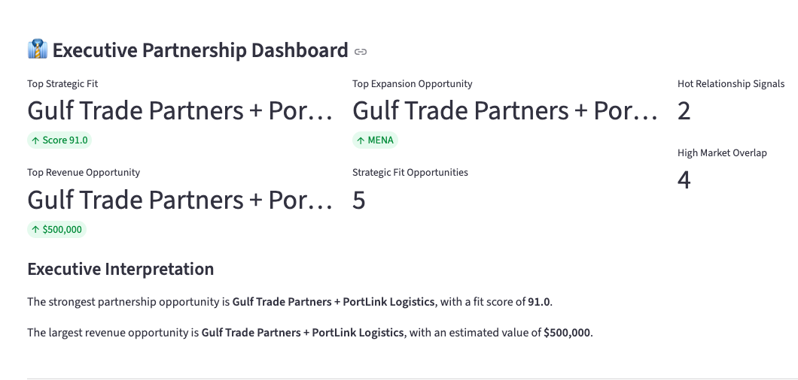
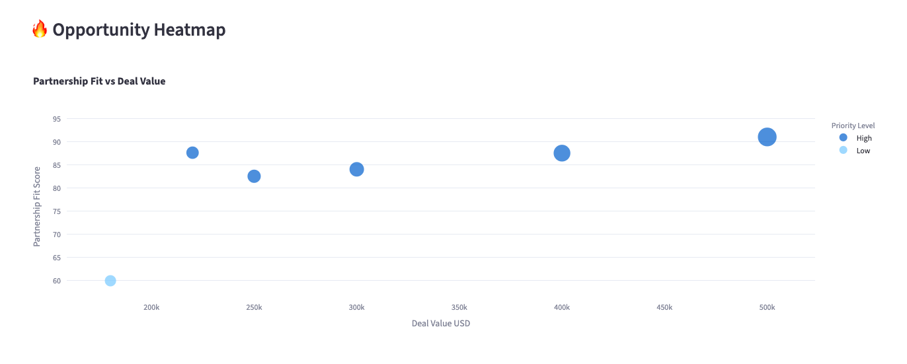
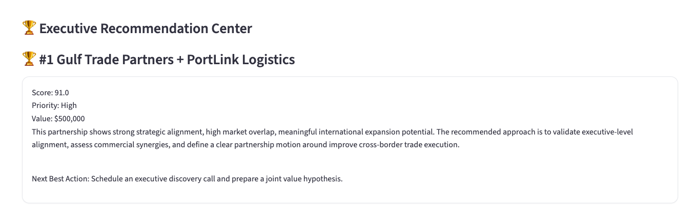
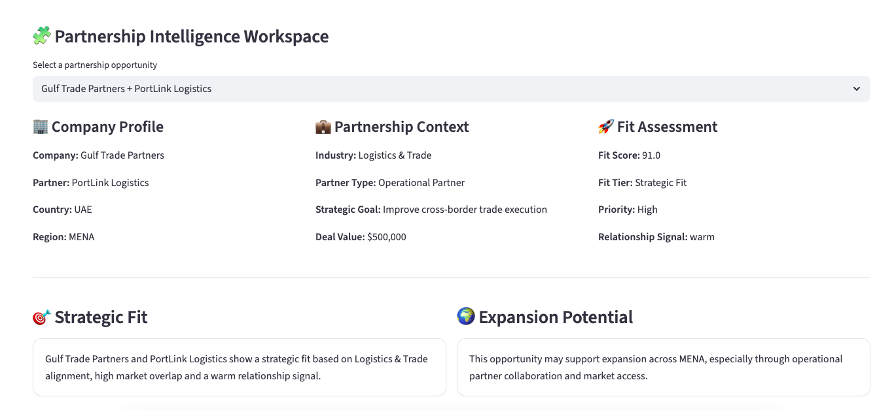

# 🤝 AI Partnership Opportunity Finder

### Live Demo

https://partnership-opportunity-finder-eambrosin.streamlit.app/

### GitHub Repository

https://github.com/Eambrosin/partnership-opportunity-finder

---

## Executive Summary

AI Partnership Opportunity Finder is an AI-powered platform designed to help Business Development, Strategic Partnerships, GTM and International Expansion teams identify, score and prioritize partnership opportunities.

The platform combines strategic alignment, market overlap, relationship strength, expansion potential and commercial opportunity value into a structured scoring framework that supports executive decision-making.

Organizations can rapidly evaluate partnership portfolios, uncover high-priority opportunities and generate executive-level partnership intelligence through a single interactive workspace.

---

## Key Features

### Executive Partnership Dashboard

Provides an executive overview of:

* Total Opportunities
* Pipeline Value
* Average Partnership Fit Score
* High-Priority Opportunities
* Top Strategic Fit
* Top Revenue Opportunity
* Top Expansion Opportunity

---

### Partnership Fit Scoring Engine

Automatically scores partnership opportunities based on:

* Regional Attractiveness
* Industry Alignment
* Market Overlap
* Relationship Signals
* Opportunity Value

Each opportunity receives:

* Partnership Fit Score
* Strategic Classification
* Priority Level

---

### Opportunity Heatmap

Interactive visualization displaying:

* Partnership Fit Score
* Commercial Opportunity Value
* Priority Level

Helping teams quickly identify the highest-impact opportunities.

---

### Regional Expansion Dashboard

Analyze strategic opportunities by region:

* LATAM
* MENA
* Europe
* North America
* APAC
* Africa

Track:

* Total Pipeline Value
* Opportunity Distribution
* Regional Prioritization

---

### Partner Portfolio Analysis

Evaluate the composition of the partnership ecosystem by:

* Distribution Partners
* Technology Partners
* Strategic Partners
* Investment Partners
* Operational Partners

Understand where partnership investments should be concentrated.

---

### Executive Recommendation Center

Automatically surfaces:

* Top Strategic Opportunities
* Highest-Impact Partnerships
* Executive-Level Recommendations
* Recommended Next Actions

Designed to support leadership decision-making and resource allocation.

---

### AI Partnership Intelligence Layer

Generates AI-style strategic insights including:

* Strategic Fit Assessment
* Expansion Potential Analysis
* Synergy Analysis
* Partnership Thesis
* AI Partnership Insight
* Recommended Introduction Strategy
* Next Best Action

---

### Partnership Intelligence Workspace

Detailed opportunity analysis including:

* Company Profile
* Partnership Context
* Strategic Assessment
* Commercial Opportunity Review
* Executive Recommendations

---

### Export Center

Export outputs as:

* Ranked Partnership CSV
* Executive Partnership Brief (.txt)

Supporting internal reviews, stakeholder communication and executive presentations.

---

## Screenshots

### Executive Partnership Dashboard



---

### Opportunity Heatmap



---

### Executive Recommendation Center



---

### Partnership Intelligence Workspace



---

## Sample Dataset

The project includes sample partnership opportunities across multiple sectors and regions.

Industries:

* Agribusiness
* Renewable Energy
* Fintech
* Logistics & Trade
* Real Estate

Regions:

* LATAM
* MENA
* Europe

The sample data demonstrates how organizations can evaluate partnership portfolios and prioritize strategic alliances.

---

## Strategic Use Cases

### Business Development

* Partnership Opportunity Qualification
* Commercial Opportunity Prioritization
* Strategic Account Expansion
* Pipeline Management

---

### Strategic Partnerships

* Partner Evaluation
* Alliance Development
* Ecosystem Expansion
* Strategic Collaboration Assessment

---

### GTM Strategy

* Channel Strategy Planning
* Market Entry Partnerships
* Distribution Expansion
* Commercial Growth Initiatives

---

### International Expansion

* Regional Opportunity Mapping
* Cross-Border Expansion Analysis
* Market Access Planning
* Strategic Growth Prioritization

---

## Technology Stack

* Python
* Streamlit
* Pandas
* Plotly

---

## Installation

Clone the repository:

```bash
git clone https://github.com/Eambrosin/partnership-opportunity-finder.git
cd partnership-opportunity-finder
```

Install dependencies:

```bash
pip install -r requirements.txt
```

Run locally:

```bash
streamlit run app.py
```

---

## Project Structure

```text
partnership-opportunity-finder/

├── app.py
├── requirements.txt
├── README.md
├── data/
│   └── sample_partnerships.csv
├── screenshots/
│   ├── executive-dashboard.png
│   ├── opportunity-heatmap.png
│   ├── recommendation-center.png
│   └── intelligence-workspace.png
└── exports/
```

---

## Future Enhancements

Potential future versions may include:

* OpenAI Integration
* Partnership Discovery Engine
* CRM Integrations
* Partner Ecosystem Mapping
* Executive Briefing Automation
* Multi-Market Scenario Planning
* Partnership Risk Assessment
* Strategic Alliance Benchmarking

---

## Author

**Eduardo Ambrosin**

Business Development | Strategic Partnerships | GTM Strategy | Revenue Operations | International Expansion | AI Applications

GitHub:

https://github.com/Eambrosin

LinkedIn:

https://www.linkedin.com/in/eduardoambrosin/

---

## Portfolio Projects

### AI Lead Qualification & Revenue Prioritization Platform

GitHub:
https://github.com/Eambrosin/lead-qualification-scorer

Live Demo:
https://lead-qualification-scorer-eambrosin.streamlit.app/

---

### AI Outreach Intelligence Platform

GitHub:
https://github.com/Eambrosin/outreach-sequence-generator

Live Demo:
https://outreach-sequence-generator-7dcmglcxfnmszlodg8lqre.streamlit.app/

---

### AI Partnership Opportunity Finder

GitHub:
https://github.com/Eambrosin/partnership-opportunity-finder

Live Demo:
https://partnership-opportunity-finder-eambrosin.streamlit.app/
