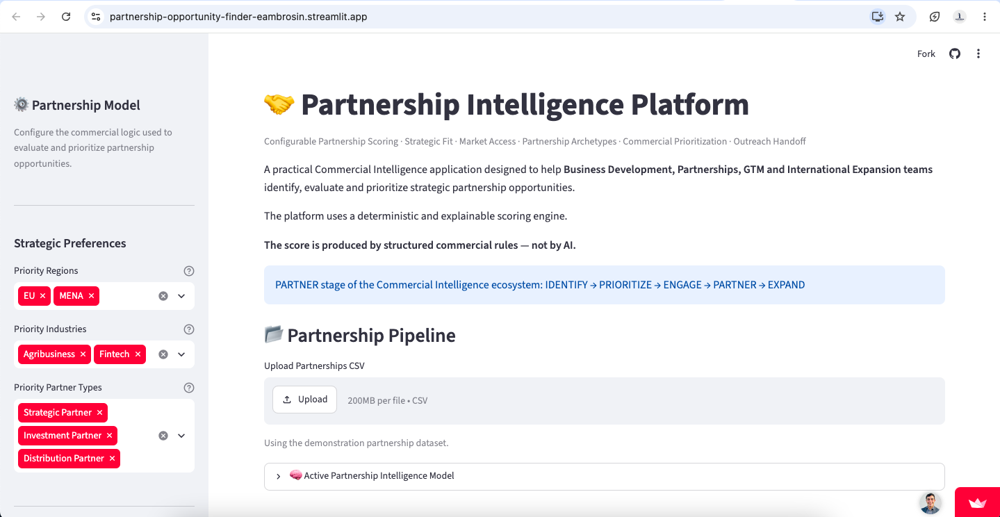
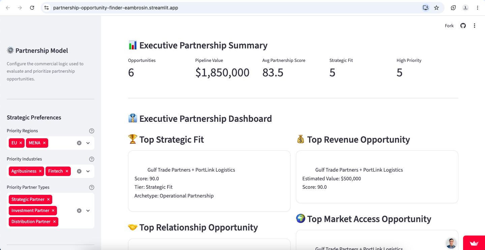
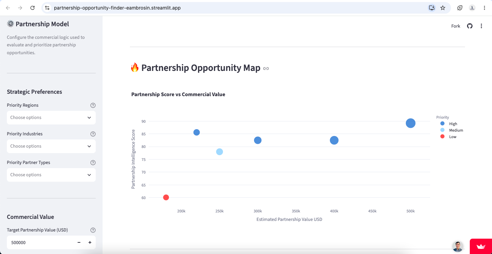
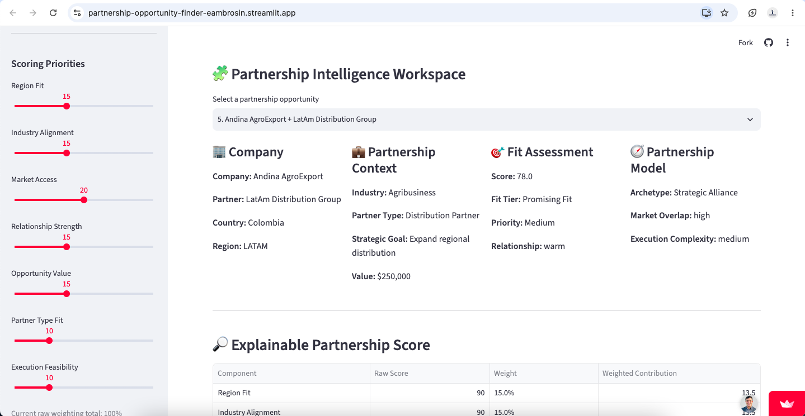
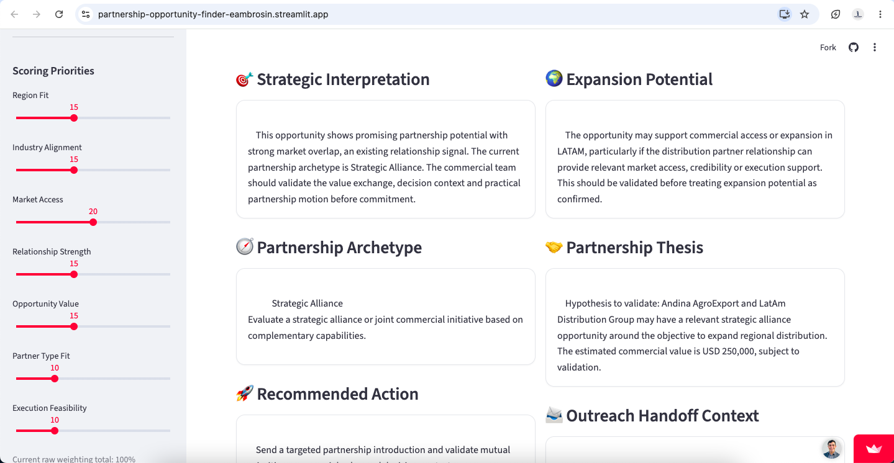

# Partnership Intelligence Platform

### Explainable Partnership Scoring | Strategic Fit | Market Access | Execution Feasibility

[](https://partnership-opportunity-finder-eambrosin.streamlit.app/)


[](https://github.com/Eambrosin/partnership-opportunity-finder/actions/workflows/ci.yml)
[](LICENSE)

A Commercial Intelligence application for evaluating, ranking and operationalizing strategic partnership opportunities using transparent scoring, market-access signals and execution feasibility.

> **A strategically attractive partner is not automatically an executable partnership.**

**[Launch the live application](https://partnership-opportunity-finder-eambrosin.streamlit.app/)**

---

## Business Problem

Partnership decisions are often driven by reputation, introductions or broad strategic narratives without enough structure.

Typical problems include:

- unclear evaluation criteria
- overvaluing brand recognition
- weak visibility into market-access contribution
- execution complexity ignored during early-stage evaluation
- partnership models chosen before fit is understood
- inconsistent comparison across partner candidates
- no explicit next action after the evaluation

The platform turns partnership evaluation into an explainable decision workflow.

---

## Partnership Workflow

```text
PARTNER CANDIDATE
        ↓
STRATEGIC FIT
        +
MARKET ACCESS
        +
RELATIONSHIP CONTEXT
        +
EXECUTION FEASIBILITY
        ↓
EXPLAINABLE SCORE
        ↓
PARTNERSHIP ARCHETYPE
        ↓
RECOMMENDED MODEL
        ↓
NEXT COMMERCIAL ACTION
```

The purpose is not to automate partnership decisions. It is to make commercial reasoning visible and comparable.

---

## Product Preview

### 1. Executive Partnership Summary



A concise view of the strongest partnership signals, priority and recommended next action.

### 2. Executive Partnership Dashboard



Compares strategic fit, market access, commercial value and execution considerations.

### 3. Partnership Opportunity Map



Helps visualize the relative position of partnership candidates across the opportunity set.

### 4. Explainable Partnership Score



Shows the contribution of each decision dimension instead of presenting an unexplained total.

### 5. Partnership Intelligence Workspace



Combines company context, partnership thesis, fit assessment, recommended model and next action.

---

## Core Capabilities

- configurable partnership strategy
- explainable weighted scoring
- strategic-fit assessment
- regional / market-access context
- relationship-strength signals
- opportunity-value context
- execution-feasibility assessment
- partner-type fit
- commercial-priority classification
- partnership archetypes
- recommended partnership models
- next-best commercial action
- executive dashboard
- opportunity mapping
- partnership brief / handoff
- CSV input compatibility
- automated tests and GitHub Actions CI
- full-history secret scanning

---

## Partnership Intelligence Model

The platform can evaluate dimensions such as:

**Region Fit**  
How relevant is the partner to the geographic strategy?

**Industry Alignment**  
Does the partner operate where the commercial proposition is strongest?

**Market Access**  
Can the partner unlock customers, channels, stakeholders or distribution?

**Relationship Strength**  
What level of existing access or credibility is already present?

**Opportunity Value**  
What commercial upside could the relationship create?

**Partner Type Fit**  
Does the organization fit the intended partnership motion?

**Execution Feasibility**  
Can both sides realistically operationalize the relationship?

Weights remain configurable so the model can reflect the partnership strategy rather than impose a universal formula.

---

## Explainable Decision Logic

```text
CONFIGURED STRATEGY
      ↓
OBSERVED / PROVIDED PARTNER INPUTS
      ↓
WEIGHTED DIMENSIONS
      ↓
SCORE BREAKDOWN
      ↓
COMMERCIAL PRIORITY
      ↓
PARTNERSHIP MODEL
      ↓
NEXT ACTION
```

The score is a decision-support mechanism, not a substitute for due diligence or negotiation.

---

## Partnership Archetypes

Depending on the commercial context, the system can support archetypes such as:

- channel partnership
- market-access partnership
- referral partnership
- operational partnership
- technology alliance
- institutional partnership
- strategic alliance

The recommended archetype is intended to make the commercial hypothesis explicit before execution begins.

---

## From Evaluation to Execution

The output can be translated into:

- target partner shortlist
- initial outreach angle
- recommended relationship model
- due-diligence questions
- pilot structure
- governance requirements
- next commercial action

For deeper execution frameworks, see:

**[Business Development Frameworks & Playbooks](https://github.com/Eambrosin/bd-frameworks-and-playbooks)**

That repository includes a Partner Due Diligence Checklist, Distributor Selection Scorecard and market-entry execution playbooks.

---

## Architecture

```text
app.py
  ↓
partnership strategy
  ↓
partnership_engine.py
  ↓
explainable scoring
  ↓
partnership archetype / model
  ↓
dashboard + opportunity brief
```

The decision logic remains deterministic and inspectable.

---

## Testing

The repository includes automated tests covering the partnership engine and scoring behavior.

Run locally:

```bash
python -m pytest -q
```

GitHub Actions runs CI on pushes and pull requests to `main`.

---

## Running Locally

```bash
git clone https://github.com/Eambrosin/partnership-opportunity-finder.git
cd partnership-opportunity-finder
pip install -r requirements.txt
streamlit run app.py
```

---

## Current Version

**v2.0.0 — Partnership Intelligence Platform**

Current functionality includes configurable partnership strategy, explainable scoring, partnership archetypes, executive decision support and execution-oriented next actions.

[View Release](https://github.com/Eambrosin/partnership-opportunity-finder/releases/tag/v2.0.0)

---

## Documentation

- [Detailed Technical Reference](docs/TECHNICAL_REFERENCE.md)
- [Tests](tests/)
- [Commercial Intelligence Portfolio](https://github.com/Eambrosin)

---

## Limitations

This is a portfolio and strategic decision-support application.

It does not replace:

- partner due diligence
- legal review
- financial review
- contract negotiation
- regulatory validation
- management judgment

---

## Portfolio Context

This project is the **PARTNER** layer of the Commercial Intelligence portfolio:

```text
IDENTIFY / Partner Universe → PARTNER → ENGAGE
```

It operates alongside the account-development workflow:

```text
IDENTIFY → PRIORITIZE → ENGAGE
```

**IDENTIFY:** [Opportunity Discovery Intelligence](https://github.com/Eambrosin/opportunity-discovery-intelligence)  
**ENGAGE:** [Adaptive Outreach Intelligence](https://github.com/Eambrosin/outreach-sequence-generator)  
**Portfolio:** [github.com/Eambrosin](https://github.com/Eambrosin)

---

## Author

**Eduardo Ambrosin**  
International Business Development | Strategic Partnerships | GTM | Commercial Intelligence
